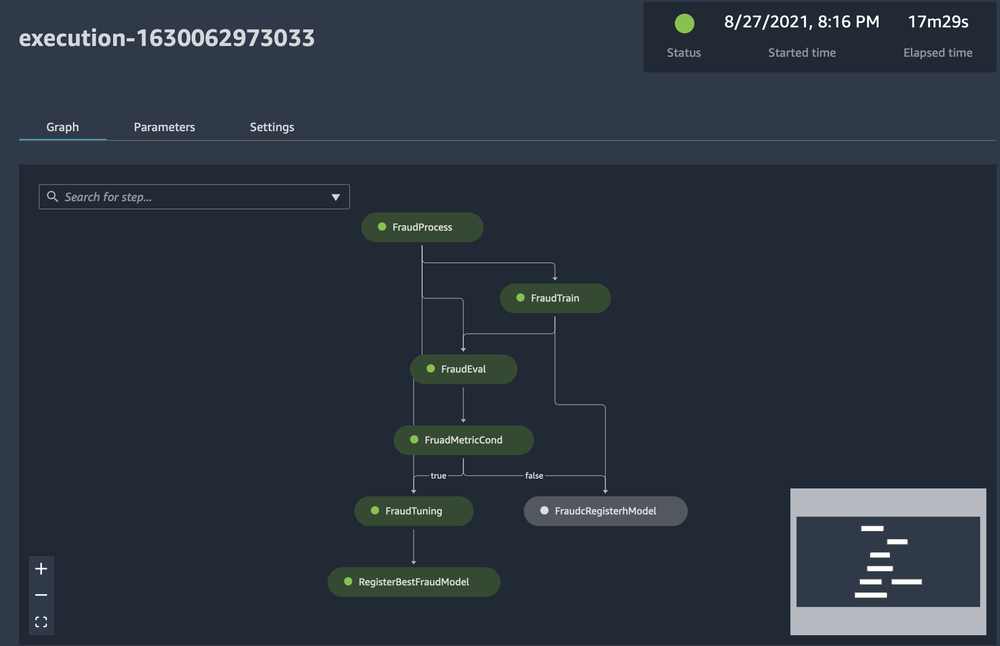
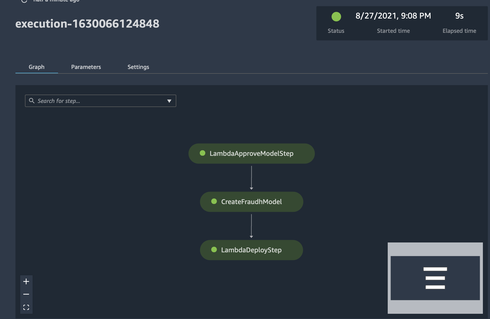

# 고급 두번째 SageMaker-Pipelines-Step-By-Step 워크샵

## 1.개요
scratch 버전에서 기본적인 데이터 전처리, 모델 훈련, 모델 배포 및 추론을 위한 개념 및 파이프라인 단계를 배웠습니다. 이제 조금더 다양한 파이프라인 단계 및 개념에 대해서 다루고자 합니다. Phase01에서는 조금더 추가된 스텝을 배웠습니다. Phase02는 Phase01 를 기반으로 하였고 기술적으로 람다 스템을 추가 하였습니다. 

- (1) 모델 빌딩 파이프라인을 생성 합니다.
    - 튜닝 스텝 이후에 최적의 성능을 보여주는 모델을 "모델 레지스트리에 등록" 합니다.
- (2) 모델 배포 파이프라인을 생성 합니다.   
    - "모델 레지스트리" 의 등록된 모델의 승인 상태를 "모델 승인" 으로 변경하고, 앤드포인트에 배포 합니다.
    - "모델 승인" 단계를 2021.08 에 새롭게 추가된 "람다 스텝" 을 이용합니다.
    - "모델 앤드포인트 배포" 단계를 역시 람다 스텝으로 진행 합니다.
    
    
- 스텝에 대한 개발자 가이드의 상세 내용은 여기를 참조 하세요. --> [파이프라인 단계 유형](https://docs.aws.amazon.com/ko_kr/sagemaker/latest/dg/build-and-manage-steps.html#build-and-manage-steps-types)

---

## 2. 워크샵 실행 후 결과
이 워크샵은 2 개의 파이프라인을 생성합니다. 

### (1) 모델 빌딩 파이프라인
- 첫번째는 현재 정의된 파이프라인을 실행하고, 조건 스텝에서 if 단계로 실행 합니다.
- 두번째는 파라미터로 valuation:roc-auc 의 평가 지표값을 바꾸어서 조건 스템에서 eles 단계로 실행 합니다.

#### (A) 첫 번째 파이프라인 실행 후 결과
- `데이터 전처리 --> 모델 훈련 --> 모델 평가 --> 모델 평가 지표의 조건 문 --> 하이퍼 파라미터 튜닝 --> 모델 레지스트리에 모델 등록 ` 의 단계를 진행 함.

### (B) 파라미터 입력을 통한 파이프라인 실행 후 결과 (캐싱 이용, 10초 이내 소요됨.)
- `데이터 전처리 (캐시이용) --> 모델 훈련 (캐시 이푱) --> 모델 평가 (캐시 이용)  --> 모델 평가 지표의 조건 문 --> 모델 레지스트리 등록  의 단계를 진행 함.

### (2) 모델 배포 파이프라인
- 모델 승인 상태 변경 --> 세이지 메이커 모델 생성 --> 앤드포인트 배포` 의 단계를 진행 함.

- 

## 3.Phase02 사용하는 단계 들
- Processing
    - 데이터 세트의 전처리 단계
    - 훈련 모델의 성능 평가 단계
- Training
    - XGBoost 알로리즘 훈련 단계
- Condition
    - 모델 평가의 기반하에 Validation:roc-auc 값의 따른 if-else 단계 
- Tuning
    - XGBosst 의 하이퍼파라미터 튜닝 단계
- RegisterModel    
    - 훈련 모델을 모델 레지스트리에 등록 단계
- Lambda
    - 사용자 정의의 코드를 실행 하는 단계 임    
- CreateModel
    - 모델 배포를 위한 세이지 메이커 모델 단계

## 4.핸즈온 환경
- [필수] 세이지 메이커의 노트북 인스턴스에서 쥬피터 노트북을 통해 실행하세요.
- [권장] 또한 세이지 메이커의 스튜디오에서 생성된 파이프라인을 GUI 로 보면서 상태를 확인 하세요.

## 5. 노트북 구성

### [Quick Approach] 
Step-By-Step으로 접근하지 않고, 빠르게 보시기 위해서는 아래 노트북만을 수행 하세요.
- 0.0.Setup-Environment.ipynb
- 1.1.Prepare-Dataset.ipynb
- 5.1.Model-Building-Pipeline.ipynb
- 6.1.deployment-pipeline.ipynb
- 7.1.Inference-Analyze.ipynb
- 8.1.Clearn_Resources.ipynb

### [Step-By-Step 접근]

- 0.0.Setup-Environment.ipynb
    - 필요한 파이썬 패키지를 설치 합니다.
    
    
- 1.1.Prepare-Dataset.ipynb
    - 데이터 세트 준비를 하고 S3에 업로드 합니다.

- 2.1.Train-Exp-Pipeline.ipynb
    - 아래의 세가지 방법 이외 (Scratch 에 포함)에 **Experiment(실험)** 를 추가하여, Trial(시도)에 따른 모델 버전 들을 추적 함.
    - 또한 훈련된 모델을 **모델 레지스트"에 등록까지 하는 과정 포함
        - 로컬 노트북에서 전처리 스크립트 실행 (예: python preprocess.py)
        - 로컬 노트북에서 로컬 모드의 다커 컨테이너로 실행
        - MBP 의 파이프라인 단계 (step_proecess) 를 생성하여 실행

- 3.1.HPO-Pipeline.ipynb
    - HPO (Hyperparameter Optimization) 를 사용 및 파이프라인의 HPO 단계를 생성
    - HPO 를 통해서 최적의 성능을 보여준 모델을 모델 레지스트리에 등록 함.
    
    
- 4.1.Eval-Pipeline.ipynb
    - 훈련된 모델을 테스트 데이터 세트로 평가하여 모델 지표를 생성하고, 이를 **조건 단계** 를 통해서 if-else 문 처리를 함.
    
    
- 5.1.Model-Building-Pipeline.ipynb
    - 위의 과정을 모두 연결하여 하나의 모델 빌딩 파이프 라인으로 생성.

- 6.1.deployment-pipeline.ipynb
    - 모델 배포 파이프라인 생성

- 7.1.Inference-Analyze.ipynb
    - 6.1 에서 생성된 앤드포인트로 실제 추론을 해봄.

- 8.1.Clearn_Resources.ipynb
    - 파이프라인, 모델 레지스트리, 실험의 리소스를 삭제 함.

---

